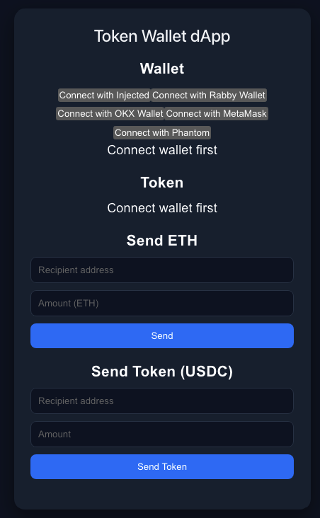
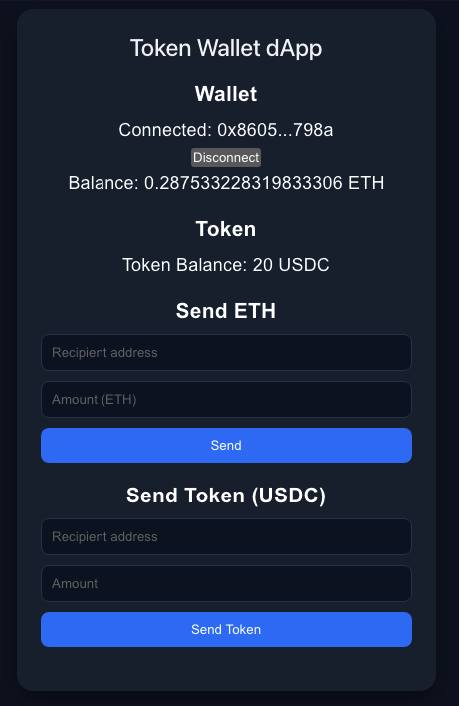
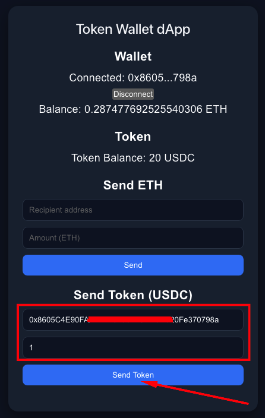
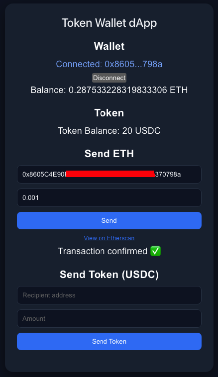

# 🪙 Token Wallet dApp

A simple decentralized application (dApp) for interacting with Ethereum and ERC20 tokens.

---

## 📸 Preview



---

## 🚀 Features

- 🔗 Connect wallet (MetaMask / injected wallets)
- 💰 View ETH balance
- 🪙 View ERC20 token balance (USDC)
- 📤 Send ETH transactions
- 💸 Send ERC20 tokens
- 🔍 Track transaction status
- 🔗 View transactions on Etherscan
- 📋 Copy wallet address & transaction hash
- ⚠️ Basic error handling and validation

---

## 🛠 Tech Stack

- **React + TypeScript**
- **Vite**
- **wagmi**
- **viem**
- **Sepolia testnet**

---

## 🌐 Live Demo

👉 https://token-wallet-dapp.vercel.app/

---

## 📦 Installation

```bash
git clone https://github.com/andrei-iarovoi/token-wallet-dapp
cd token-wallet-dapp
npm install
npm run dev
```

---

## ⚙️ Usage

1. Connect your wallet
2. Switch to **Sepolia network**
3. View your ETH and token balances
4. Send ETH or USDC tokens
5. Track transaction status

---

## 📸 Screenshots

### 🟢 Main UI


### 🔗 Wallet Connected



### 📤 Send Transaction



### ✅ Success State



---

## ⚠️ Notes

- Works on **Sepolia testnet**
- Requires test ETH (faucet):
  - https://sepoliafaucet.com/

- Token used: **USDC (test deployment)**

---

## 🧠 What I Learned

- Working with **wagmi & viem**
- Handling blockchain transactions and states
- Managing async flows (pending, success, error)
- Building basic Web3 UX (copy, feedback, status)
- Applying TypeScript in Web3 context

---

## 🔮 Future Improvements

- Toast notifications
- Improved UI/UX (cards, animations)
- Wallet selector (RainbowKit / ConnectKit)
- Better validation and error handling
- Multi-token support

---

## 👨‍💻 Author

- GitHub: https://github.com/andrei-iarovoi/token-wallet-dapp

---

## 📄 License

MIT
